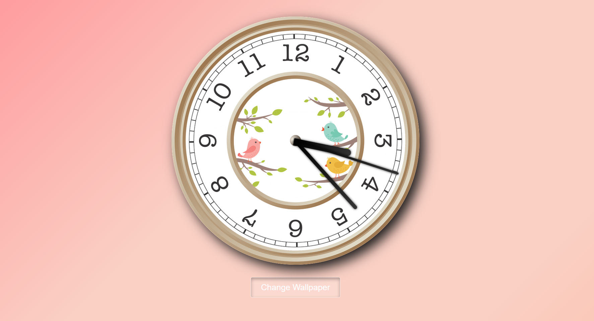

# Analog Clock

Welcome to the **Analog Clock** project! This web-based analog clock combines elegance with functionality, featuring dynamic wallpapers and realistic clock hands. Built using HTML, CSS, and JavaScript, this project showcases smooth transitions and interactive elements.

  <!-- Replace with a preview image -->

## Features 

- **🎨 Dynamic Wallpaper Change**: Seamlessly switch between various clock backgrounds with a single click. Enjoy a smooth transition effect that enhances the visual experience.
  
- **⏰ Realistic Clock Hands**: Designed with gradients and shadows, the clock hands create a realistic look. They rotate smoothly to reflect the accurate time, with subtle animations for a polished effect.

- **✨ Enhanced Animations**: Experience fluid transitions and easing effects for the clock hands. The clock also features a subtle pulse effect upon interaction, adding a dynamic touch.

- **📱 Responsive Design**: The layout adapts to different screen sizes, ensuring that the clock and button are well-aligned and visible on both large and small screens.

- **🔊 Analog Watch Sound Effect**: Hear the gentle ticking of an analog clock, adding an auditory touch to the visual experience. The sound effect plays in sync with the clock's movement, enhancing realism.

- **🔲 Visual Effects**: The button is designed to blend seamlessly with the background, featuring realistic depth and shadow effects to enhance visibility and interaction.

- **♿ Accessibility**: Designed with responsiveness and accessibility in mind, ensuring usability across various devices and screen sizes.

## How It Works

1. **HTML Structure**: The HTML file sets up the basic structure of the clock and the change wallpaper button, including the necessary div elements for the clock hands and button.

2. **CSS Styling**: The CSS file applies styling to the clock and button, incorporating background images, gradients, and shadows to achieve a realistic look. Media queries ensure proper layout adjustments for different screen sizes.

3. **JavaScript Logic**: The JavaScript file manages the clock's functionality:
   - **Clock Rotation**: Uses `setInterval` to update the rotation of the clock hands every second. Calculates rotation angles based on the current time and applies smooth transitions.
   - **Wallpaper Change**: The `changeWallpaper` function handles dynamic background changes with smooth transitions between different wallpapers.

4. **Responsive Design**: CSS media queries adjust the layout and size of the clock and button for smaller screens, maintaining proper alignment and visual appeal.

## Installation

1. **Clone the Repository**:

   ```bash
   git clone https://github.com/your-username/analog-clock-with-dynamic-wallpaper.git

## Contributing

🚀 **We’d Love Your Input!**

Got ideas, improvements, or spot a bug? **We invite you to be a part of this project!** Here’s how you can contribute:

- **🔄 Submit a Pull Request**: Share your awesome code changes, features, or bug fixes. We’re excited to review and merge your contributions!
  
- **📝 Open an Issue**: If you encounter any problems or have suggestions for enhancement, let us know by opening an issue. Your feedback helps us improve!

**Your contributions make this project better, and we truly appreciate your involvement.** Feel free to reach out if you have any questions or need guidance.

**Thank you for being a part of our community!** 🙌
